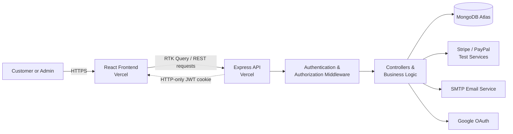
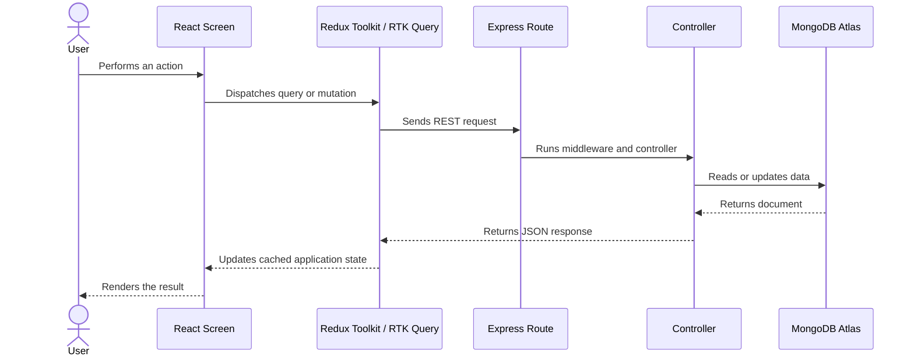
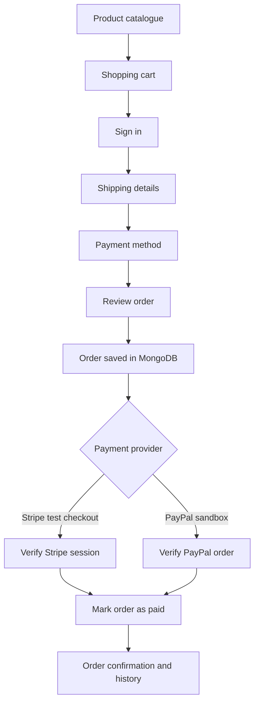
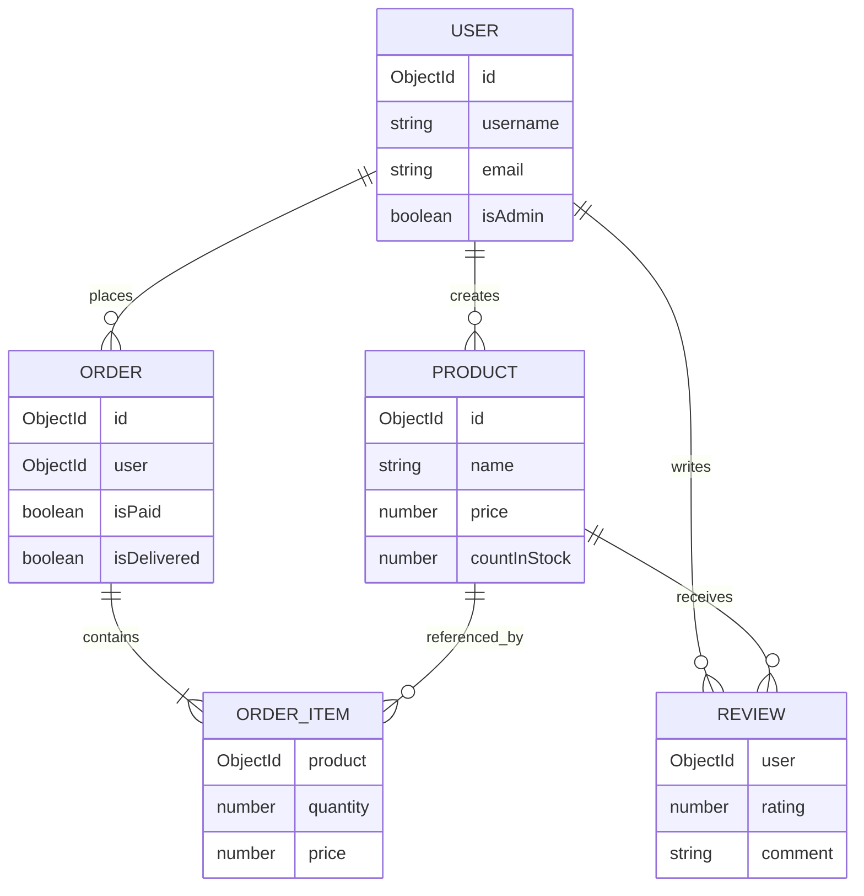

# Parin Studio — Full-Stack E-commerce Portfolio

[](https://parinstudio-finaldemo-web.vercel.app/)

**Live website:** [parinstudio-finaldemo-web.vercel.app](https://parinstudio-finaldemo-web.vercel.app/)


Parin Studio is a full-stack e-commerce web application created for a nature-inspired stationery brand. The project combines a calm, responsive shopping experience with a REST API, customer accounts, checkout flows, and an administration area for managing the store.

> This is a portfolio demonstration. Payments use sandbox/test integrations and the store contains demonstration data.

## What the application does

### Customer experience

- Browse, search, and paginate products
- View product details, stock availability, ratings, and reviews
- Add products to a persistent shopping cart
- Complete shipping and payment steps
- Create an account, sign in, verify email, and reset a password
- View profile information and order history

### Store administration

- Create, edit, and remove products
- Manage users and customer orders
- Update homepage content and store settings
- Control payment configuration from the admin interface
- Protect management routes with role-based authorization

## System architecture



The frontend and API are deployed as separate Vercel projects. The frontend receives the API address through an environment variable, while the API allows requests only from the configured frontend origin. Authentication is maintained with a JWT stored in an HTTP-only cookie.

## How a request moves through the project



For protected actions, authentication middleware verifies the cookie before the controller is allowed to access or change data. Admin routes include an additional role check.

## Checkout flow



Payment status is verified by the backend before an order is marked as paid; the browser is not treated as the source of truth.

## Project structure

```text
parin-studio/
├── frontend/
│   ├── public/                 Static brand and homepage assets
│   └── src/
│       ├── components/         Shared navigation and UI components
│       ├── screens/            Customer and admin pages
│       ├── slices/             Redux state and RTK Query endpoints
│       ├── assets/             Styles and bundled logo
│       ├── App.js              Application routes
│       └── store.js            Redux store configuration
├── backend/
│   ├── config/                 Database connection
│   ├── controllers/            Application and payment logic
│   ├── middleware/             Authentication and error handling
│   ├── models/                 Mongoose data models
│   ├── routes/                 REST API endpoints
│   └── server.js               Express application entry point
├── index.js                    Vercel serverless entry point
├── vercel.json                 API deployment configuration
└── example.env                 Environment variable reference
```

## Technology stack

| Area | Technologies | Responsibility |
| --- | --- | --- |
| Interface | React, React Router, React Bootstrap | Responsive storefront and admin screens |
| Client state | Redux Toolkit, RTK Query | Cart, authentication state, API caching, queries, and mutations |
| API | Node.js, Express | REST endpoints, validation, and business logic |
| Data | MongoDB Atlas, Mongoose | Users, products, reviews, orders, and site settings |
| Security | JWT, HTTP-only cookies, bcrypt | Sessions, password hashing, and protected routes |
| Integrations | Google OAuth, Stripe, PayPal, Nodemailer | Sign-in, test payments, and transactional email |
| Deployment | Vercel | Separate frontend and serverless API deployments |

## Key engineering decisions

- **Separated client and API:** each application can be deployed and configured independently.
- **Centralized server state:** RTK Query provides reusable API endpoints, caching, loading states, and cache invalidation.
- **Server-verified payments:** Stripe and PayPal results are checked by the API before order records change.
- **Layered backend:** routes, middleware, controllers, and models have separate responsibilities.
- **Cookie-based authentication:** JWTs are kept out of client-side JavaScript by using HTTP-only cookies.
- **Environment-based configuration:** database credentials, API URLs, OAuth details, email credentials, and payment secrets remain outside source control.

## Main data relationships



## Running locally

For reviewers who want to inspect the code locally:

```bash
npm install
npm install --prefix frontend
npm run dev
```

Create `.env` from [`example.env`](example.env) and provide at least `MONGO_URI` and `JWT_SECRET`. The frontend runs on `http://localhost:3000` and the API runs on `http://localhost:5000`.

## Deployment notes

- Frontend: [parinstudio-finaldemo-web.vercel.app](https://parinstudio-finaldemo-web.vercel.app/)
- API: [parinstudio-finaldemo.vercel.app](https://parinstudio-finaldemo.vercel.app/)
- Frontend and backend environment variables are configured separately in Vercel.
- Repository images are used for the deployed demo because Vercel's serverless filesystem is not persistent.

## Portfolio focus

This project demonstrates end-to-end ownership of a MERN application: user experience design, reusable React components, client-side state management, REST API design, data modelling, authentication and authorization, payment workflow integration, third-party services, and cloud deployment.
